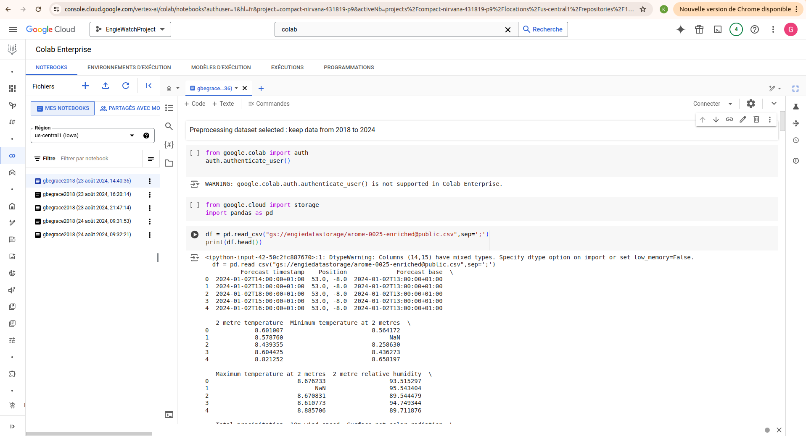
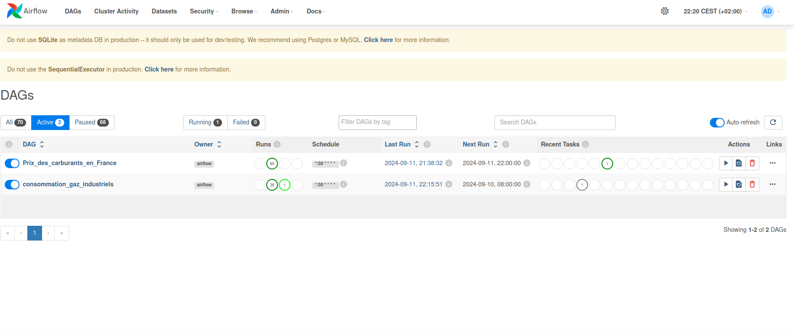
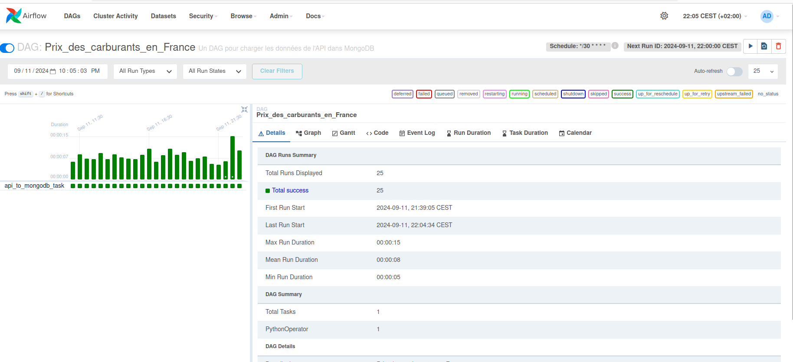

# 🚀 Détection d'Anomalies dans la Consommation d'Énergie

### Langage

### Frameworks et Outils de Développement

### Machine Learning & Data Science

### Cloud & Stockage

### CI/CD et Outils de Débogage

## 📑 Sommaire
1. [🔍 Contexte du Projet](#contexte-du-projet)
2. [🎯 Pourquoi ce projet ?](#pourquoi-ce-projet)
3. [🎯 Objectifs du Projet](#objectifs-du-projet)
4. [🏗️ Architecture du Projet](#architecture-du-projet)
5. [⚙️ Intégration Continue (CI) et Tests Unitaires](#intégration-continue-ci-et-tests-unitaires)
6. [🌍 Calcul de l'Empreinte Carbone du Projet](#co2)
7. [📂 Structure du Projet](#structure-du-projet)
8. [🔄 Pipelines de Collecte de Données avec Kedro](#pipelines-de-collecte-de-données-avec-kedro)
9. [💻 Traitement des Données et Utilisation de Google Colab](#traitement-des-données-et-utilisation-de-google-colab)
10. [🤖 Modèles de Machine Learning](#modèles-de-machine-learning)
11. [🖥️ Interface Utilisateur](#interface-utilisateur-avec-streamlit)
12. [📊 Ordonnancement des Données](#ordonnancement-des-données-avec-airflow)
13. [📜 Conclusion](#conclusion)
14. [⚠️ Difficultés Rencontrées](#difficultés_rencontrées)
15. [🚀 Prochaines Étapes : Phase 2 - Forecasting ](#prochaine_etapes)

## 1. 🔍 Contexte du Projet
La détection précoce des anomalies énergétiques est essentielle pour la gestion proactive de l'énergie, en particulier pendant les périodes de forte demande (hiver, été) ou durant des événements comme les mouvements sociaux. Ce projet vise à identifier ces anomalies en se basant sur des données variées (météorologiques, sociales, etc.) et à fournir une interface utilisateur permettant la visualisation et l'analyse des résultats. La solution est structurée en plusieurs sous-projets interconnectés, chacun avec des objectifs spécifiques.

## 2. 🎯 Pourquoi ce projet ? 
Nous avons identifié plusieurs défis majeurs dans la gestion énergétique :
- **Surconsommation en Hiver et en Été** : Augmentation significative de la demande en électricité pendant les périodes de froid ou de chaleur extrême.
- **Jours Fériés et Mouvements Sociaux** : Les variations imprévues dans la consommation peuvent déséquilibrer l'offre et la demande.

Nos cibles principales incluent :
- **Entreprises d'Électricité** (comme Engie et EDF) qui doivent surveiller la consommation en temps réel et ajuster leur production.
- **Industries à Forte Consommation** qui nécessitent une gestion optimale de leur énergie pour éviter des interruptions.

## 3. 🎯 Objectifs du Projet 
Notre projet se concentre sur six grands objectifs :
1. **🔍 Détection des Anomalies** : Identifier en temps réel les anomalies de consommation.
2. **📈 Prédiction de la consommation** : Utiliser des modèles prédictifs pour prédire la consommation.
3. **⚡ Optimisation des Ressources** : Aider les entreprises à optimiser leur consommation énergétique.
4. **🔄 Amélioration Continue** : Intégrer les retours des utilisateurs pour perfectionner notre système.
5. **🌍 Réduction de l'Empreinte Carbone** : Calculer l'impact carbone de nos serveurs et de nos traitements de données.

## 4. 🏗️ Architecture du Projet 
Le projet est divisé en plusieurs modules interconnectés, chacun jouant un rôle clé dans l'ensemble du système.

- **🛠️ Module Collecte et Stockage des Données**
- **🛠️ Module Traitement, Stockage et Visualisation**
- **🛠️ Module Entraînement et Suivi des Modèles**
- **🛠️ Module Déploiement et Feedback**
- **🛠️ Module d'Orchestration et Conteneurisation**
- **🛠️ Module Intégration Continue (CI) et Tests Unitaires**

## 5. ⚙️ Intégration Continue (CI) et Tests Unitaires 
Nous avons mis en place une intégration continue (CI) via **GitHub Actions**, qui exécute des tests unitaires et des analyses statiques à chaque commit sur les différents sous-projets.

### Outils utilisés pour la CI :
- **🧪 Pytest** pour l'exécution des tests unitaires.
- **🔍 Pylint, Black, Mypy** pour l'analyse statique du code et le respect des conventions de style. Nous avons obtenu un score de **10/10 sur Pylint**, garantissant un code de haute qualité.
- **📊 Coverage** pour mesurer la couverture des tests, avec un rapport généré après chaque exécution de CI afin d'assurer que l'ensemble du code est bien couvert par les tests.

Le pipeline de CI, configuré dans le répertoire `.github/workflows`, est accessible via [ce lien](https://github.com/keagnon/DetectionAnomalie/actions/runs/10837858597/job/30074776315).

En outre, chaque module du projet est containerisé avec **Docker** pour assurer la portabilité et la cohérence des environnements. Les fichiers `.env` permettent une configuration flexible des variables d'environnement.

## 6. Calcul de l'Empreinte Carbone du Projet 

Dans notre projet, nous avons intégré le calcul de l'empreinte carbone à chaque sous-projet nécessitant beaucoup de calculs (comme l'entraînement des modèles et les pipelines ETL ) afin d'évaluer l'impact environnemental de chaque composant. À travers l'utilisation d'outils tels que **CodeCarbon**, nous avons mesuré les émissions générées par les différentes étapes, allant du traitement des données à l'entraînement des modèles de machine learning, ainsi que l'exécution des pipelines. Chaque sous-projet a donc été conçu pour suivre l'empreinte carbone associée, permettant de comprendre où se concentrent les émissions les plus importantes et de proposer des solutions d'optimisation.

En mesurant l'empreinte carbone générée par l'infrastructure du projet (serveurs, pipelines, ressources cloud) et les traitements des données (prévisions météorologiques, mouvements sociaux), nous avons pu :
- Quantifier l'impact environnemental de chaque tâche et ajuster les ressources en conséquence.
- Explorer des moyens de réduction, comme l'utilisation de sources d'énergie renouvelable, l'optimisation des algorithmes pour réduire leur consommation énergétique, ou encore le passage à des infrastructures plus économes en énergie.
- Fournir aux entreprises une estimation de leur propre impact carbone, en leur permettant de prendre des décisions éclairées pour minimiser cet impact à chaque étape du processus.

Cette approche `"green AI"` nous a permis de concilier performance algorithmique et responsabilité écologique dans l'ensemble du projet.

## 7. 📂 Structure du Projet 
(Insérer la structure détaillée du projet ici)

Nous utilisons un **🛠️ Makefile** pour automatiser les processus de build, de tests et faciliter la gestion de la CI en local. De plus, nos variables suivent le style `snake_case` et nous avons ajouté des `docstrings` dans toutes les parties du projet.

## 8. 🔄 Pipelines de Collecte de Données avec Kedro 
Cette partie est un sous projet développer pour la partie ingestion des données et est inclus dans notre projet de détection d'anomalie .
Deux pipelines Kedro ont été mis en place :
1. **Pipeline ETL** : Ce pipeline collecte, transforme et stocke les données dans MongoDB.
2. **Pipeline data fusion** : Ce pipeline charge les données, les fusionne et les stocke dans Elasticsearch.

Pour accéder à ce sous projet et àvoir plus de détails, consultez le [Accéder au sous projet data-collection-kedro](https://github.com/keagnon/DetectionAnomalie/blob/grace_clustering_mvt/data-collection-kedro/README.md).

## 9. 💻 Traitement des Données et Utilisation de Google Colab 
Certaines données volumineuses ont été traitées avec **Google Colab**, notamment pour les membres de l'équipe ayant des limitations matérielles. Voici une capture d'écran de nos notebooks sur Google Colab ainsi que notre bucket GCP pour le stockage des données et artefacts.

## 10. 🤖 Modèles de Machine Learning 
Grâce ànos pipelines de collecte, stockage et fusion des données, les données ont été divisées en deux groupes :
1. **Consommation journalière par région avec données météorologiques**.
2. **Consommation journalière et mouvements sociaux** (avec une colonne "mouvement social" indiquant les jours avec des événements).

Ces deux groupes de données ont conduit à deux sous-projets distincts :
- [Accéder au sous-projet sur la consommation régionale et les données météo](lien_readme_conso_meteo).
- [Accéder au sous-projet sur la consommation et les mouvements sociaux](https://github.com/keagnon/DetectionAnomalie/blob/grace_clustering_mvt/ml_models/mouvements_consommation/Readme.md).

Ces sous-projets, ainsi que notre interface Streamlit, utilisent **MLflow** pour le suivi et la mise en production des modèles. Un serveur **MLFlow** a été déployé sur une VM GCP pour permettre à l'équipe de suivre les performances des modèles.

## 11. 🖥️ Interface Utilisateur 
L'interface utilisateur finale a été développée avec **Streamlit**. Elle permet :
- Le téléchargement de datasets.
- La visualisation des résultats des modèles de machine learning.
- La collecte de feedbacks utilisateurs.

Cette interface est un sous projet de notre projet de détection d'anomalie. Elle est déployée localement et sur **Streamlit Community**. Pour accéder à ce sous projet et avoir plus de détails,cliquer sur [Sous projet Dashboard Streamlit](https://github.com/keagnon/DetectionAnomalie/blob/grace_clustering_mvt/dashboard_ui/Readme.md).

## 12. 📊 Documentation
Nous avons documenté plusieurs étapes critiques du projet :
1. **Mise en place d’un serveur MLFlow sur GCP** : [documentation_mlflow](https://github.com/keagnon/DetectionAnomalie/blob/grace_clustering_mvt/documentation/etapes_mise_en_place.pdf)
2. **Mise en place d’un serveur Airflow en local** : [documentation_airflow](https://github.com/keagnon/DetectionAnomalie/blob/grace_clustering_mvt/documentation/etapes_installation_airflow.txt)
3. **Ordonnancement des Données** : [documentation_ordonnoncement](https://github.com/keagnon/DetectionAnomalie/blob/grace_clustering_mvt/documentation/Ordonnoncements_donn%C3%A9es.pdf)
4. **Documentation amazone** : [documentation_amazone](https://github.com/keagnon/DetectionAnomalie/blob/grace_clustering_mvt/documentation/Documentation_amazone S3.odt)
4. **Mise en place elastic search** : [documentation_elastic](https://github.com/keagnon/DetectionAnomalie/blob/grace_clustering_mvt/documentation/Documentation mise en place elastic.pdf)

**Airflow** est utilisé pour orchestrer les pipelines de collecte de données via des DAGs. Un exemple de DAG est utilisé pour enrichir nos datasets avec des données d'API. Ce script Airflow s'exécute toute les 30 minutes. Voici des images de notre DAG et de notre interface Airflow :

## 13. 📜 Conclusion 
Le projet de détection d'anomalies dans la consommation d'énergie a permis de mettre en place une solution complète, modulaire et scalable. Grâce à l'intégration de diverses technologies, nous avons réussi à développer un système robuste capable d'identifier des anomalies dans les données de consommation énergétique. En combinant des données météorologiques, sociales et de consommation, nous avons pu générer des insights précieux qui aident les entreprises à optimiser leur utilisation d'énergie.

## 14. ⚠️ Difficultés Rencontrées 
Malgré les succès obtenus, plusieurs défis ont été rencontrés au cours du projet :

- **Gestion des Données Massives** : Le traitement de grands volumes de données, en particulier les prévisions météorologiques et les mouvements sociaux, a posé des problèmes de performance, notamment sur les machines locales. Pour contourner ces limites, nous avons utilisé Google Colab et Google Cloud Platform (GCP). Lors de la collecte des données avec Kedro, nous avons dû les traiter en lots (batch processing), et même après la fusion des données, l'insertion dans Elasticsearch s'est faite en petits morceaux (chunks) pour éviter des surcharges.

- **Intégration de Technologies Multiples** : L'intégration de divers outils et frameworks (Kedro, MLflow, Docker, Elasticsearch) a été un défi, car certaines incompatibilités et la gestion des dépendances ont ralenti le développement. La configuration du serveur MLflow a également nécessité des ajustements techniques complexes.

- **Disponibilité et Qualité des Données** : La collecte de données provenant de sources variées (PDF, captures d'écran, fichiers XML) a créé des difficultés, notamment lors de la fusion des ensembles de données. Certaines périodes manquaient de données, et certaines dates ne correspondaient pas, compliquant la création d'un dataset cohérent.

- **Contraintes Budgétaires** : Le manque de crédits sur GCP a limité nos expérimentations, obligeant certaines parties du projet à être déployées sur des infrastructures locales ("on-premise"), ce qui a restreint les capacités et l'échelle des tests.

- **Données sur l’Empreinte Carbone** : Nous avons envisagé d'incorporer des données sur l'empreinte carbone par région pour ajouter une dimension "green AI" au projet, où l’optimisation de la consommation énergétique des algorithmes serait un objectif. Cependant, ces données se sont avérées difficiles à trouver. Chaque région ou secteur pourrait avoir un facteur d'émission différent, selon la source d’énergie utilisée. Cela aurait permis de prédire la demande énergétique tout en tenant compte des mouvements sociaux et de fournir des recommandations pour minimiser l’impact carbone en ajustant les sources d’énergie (comme passer du charbon aux énergies renouvelables). Malheureusement, ces données étaient insuffisantes pour mener à bien cette analyse.

## 15. 🚀 Prochaines Étapes : Phase 2 - Forecasting 
La prochaine étape du projet est de passer à la **Phase 2 : Forecasting**. Nous avons pour objectif d'étendre le système actuel pour inclure des modèles de prévision basés sur des séries temporelles, afin d'anticiper les incidents futurs en se basant sur des données historiques et actuelles.

### Objectifs de la Phase 2 :
- **Prédiction des Risques d'Incidents** : Prédire les risques d'incidents sur une période de 2 à 3 mois.
- **Anticipation des Impacts** : Anticiper les impacts des conditions météorologiques et des événements sociaux sur la consommation énergétique.
- **Optimisation de la Planification** : Aider les entreprises à planifier et à ajuster leurs stratégies en fonction des prévisions.

### Détails :
Nous avons déjà réalisé un Proof of Concept (PoC), et l'objectif sera de rendre le système capable d'effectuer des prévisions précises et pertinentes. En combinant les données de séries temporelles avec les informations sur la consommation et les événements extérieurs, nous pourrons proposer des prévisions plus précises aux entreprises pour les aider à optimiser leurs ressources et éviter les incidents énergétiques.

Le système actuel est conçu de manière modulaire, ce qui permettra une transition fluide vers cette phase de forecasting et facilitera l'adaptation continue aux besoins changeants des entreprises et du marché.
