# 📊 Anomaly Detection Dashboard (Streamlit)

### Langage


### Frameworks et Outils de Développement


### Machine Learning & Data Science


### Cloud & Stockage


## 📑 Introduction

Ce projet est le **tableau de bord final** développé avec **Streamlit** qui englobe toutes les fonctionnalités des différents modèles développés dans le cadre de notre projet de **détection d'anomalies**. Ce tableau de bord permet d'interagir avec plusieurs modèles de machine learning et d'observer leurs performances sur différentes tâches.

Cette partie de notre projet de **détection d'anomalies** se concentre sur les aspects suivants :

- 📈 **Détection d'anomalies** pour repérer des comportements anormaux dans les données.
- 🧠 **Clustering** pour grouper les données par région et mieux comprendre les tendances.
- 🔮 **Prédiction de la consommation** d'énergie en prenant en compte les conditions météorologiques et les mouvements sociaux.
- 📝 **Feedback utilisateur** pour améliorer les modèles en continu.
- 🔍 **Suivi des résultats** et des métriques des modèles via **MLflow**.


## 📚 Sommaire

1. [📦 Installation](#installation)
2. [🚀 Lancer l'application](#lancer-lapplication)
3. [📊 Fonctionnalités](#fonctionnalités)
   - [🔍 Détection d'anomalies](#détection-danomalies)
   - [🧠 Clustering](#clustering)
   - [🔮 Prédiction de la consommation en prenant en considération les mouvements sociaux](#prédiction-de-la-consommation)
   - [☁️ Prédiction de la cosommation en prenant en compte les conditions météorologiques](#prédiction-météo)
   - [📝 Feedback utilisateur](#feedback-utilisateur)
   - [📈 Suivi des résultats et des modèles](#suivi-des-résultats-et-des-modèles)
5. [📁 Structure du projet](#structure-du-projet)
6. [🖼️ Captures d'écran](#captures-d’écran)


## 📦 Installation <a name="installation"></a>

Avant de commencer, assurez-vous d'avoir **Python 3.9+** et **Docker** installés sur votre machine.

### Étapes d'installation :

1. **Clonez ce dépôt :**

   ```bash
   git clone https://github.com/keagnon/DetectionAnomalie.git
   cd DetectionAnomalie
   ```

2. **Installez les dépendances :**

   ```bash
   pip install -r requirements.txt
   ```

3. **Configuration des variables d'environnement :**

   Créez un fichier `.env` et renseignez les informations de connexion, notamment MongoDB et Elasticsearch :

   ```env
    GOOGLE_APPLICATION_CREDENTIALS=chemin/vers/fichier.json
    MLFLOW_TRACKING_URI=url-de-suivi-mlflow
    MLFLOW_ARTEFACTS_LOCATION=gs://votre-bucket/mlflow_experiment
    AWS_ACCESS_KEY=votre-aws-access-key
    AWS_SECRET_KEY=votre-aws-secret-key
    S3_BUCKET_NAME=bucketfeedbacks
    S3_REGION_NAME=eu-west-3
   ```


## 🚀 Lancer l'application <a name="lancer-lapplication"></a>

### Localement avec Python :

```bash
streamlit run app.py
```

### Avec Docker ⚙️ :

Le projet est entièrement **dockerisé** pour faciliter le déploiement dans différents environnements.

1. **Construisez l'image Docker :**

   ```bash
   docker build -t anomaly-dashboard .
   ```

2. **Exécutez le conteneur Docker :**

   ```bash
   docker run -p 8501:8501 --env-file .env anomaly-dashboard
   ```

Accédez à l'application via [http://localhost:8501](http://localhost:8501).


## 📊 Fonctionnalités <a name="fonctionnalités"></a>

### 🔍 Détection d'anomalies <a name="détection-danomalies"></a>

La section **détection d'anomalies** utilise des modèles comme **Isolation Forest** pour détecter des comportements anormaux dans les données de consommation. Lorsque des données sont chargées via l'interface, un tableau s'affiche avec les données chargées. Les anomalies sont soulignées en rouge.


### 🧠 Clustering <a name="clustering"></a>

Dans cette section, nous utilisons des algorithmes de clustering tels que **DBSCAN** et **K-means** pour regrouper les données en clusters distincts. L'utilisateur peut charger des données via notre interface, visualiser les clusters et analyser les tendances.


### 🔮 Prédiction de la consommation prise en compte des mouvements sociaux <a name="prédiction-de-la-consommation"></a>

Cette section permet de tester et de visualiser les résultats de différents modèles de prédiction de la consommation énergétique. L'utilisateur peut charger des données, tester les modèles et voir les prédictions sous forme de graphiques interactifs.


### ☁️ Prédiction dela consommation prise en compte météo <a name="prédiction-météo"></a>

Similaire à la prédiction de la consommation, cette section utilise des modèles pour prédire les conditions météorologiques et analyser leur impact sur la consommation d'énergie.


### 📝 Feedback utilisateur <a name="feedback-utilisateur"></a>

Cette section permet aux utilisateurs d'envoyer des retours sur les prédictions et les anomalies détectées. Les retours utilisateurs sont stockés dans **Aws** et utilisés pour améliorer les modèles.


### 📈 Suivi des résultats et des modèles <a name="suivi-des-résultats-et-des-modèles"></a>

Le suivi des résultats est effectué avec **MLflow**, qui permet de visualiser les performances des modèles, de comparer les différentes versions, et de suivre l'historique des expériences via une interface dédiée. Au clic sur l'onglet  **Tracking**, vous serez rediriger vers notre serveur Mlflow mis en place pour notre équipe.


## 📁 Structure du projet <a name="structure-du-projet"></a>

Voici un aperçu de la structure du projet :

```bash
dashboard_ui/
│
├── app.py                      # Point d'entrée principal pour Streamlit
├── Dockerfile                   # Fichier Docker pour le déploiement
├── requirements.txt             # Dépendances Python
├── .env                         # Fichier des variables d'environnement (non inclus dans Git)
├── styles.css                   # Styles CSS pour l'application
│
├── page_anomalie_detection.py    # Page de détection d'anomalies
├── page_clustering.py            # Page de clustering
├── page_feedback.py              # Page pour les retours utilisateur
├── page_prediction_conso.py      # Page pour les prédictions de consommation
├── page_prediction_meteo.py      # Page pour les prédictions météo
├── page_tracking.py              # Page pour le suivi des résultats avec MLflow
│
├── mlruns/                       # Répertoire de suivi MLflow
└── dashboard_ui_streamlit/        # Fichiers et assets supplémentaires
```


## 🖼️ Captures d'écran <a name="captures-d’écran"></a>

1. **Détection d'anomalies**

   
   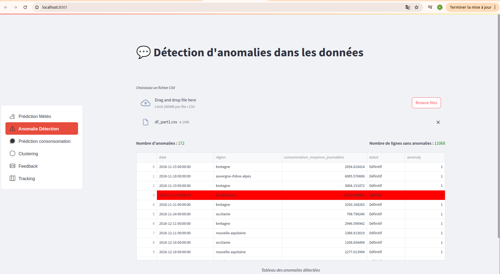
   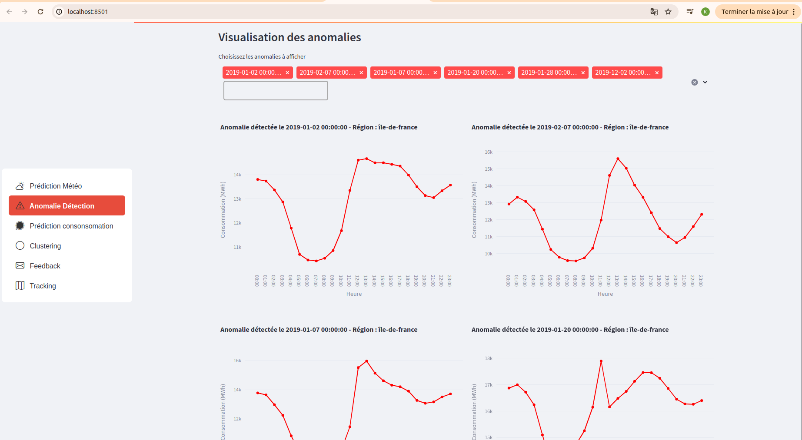
   
   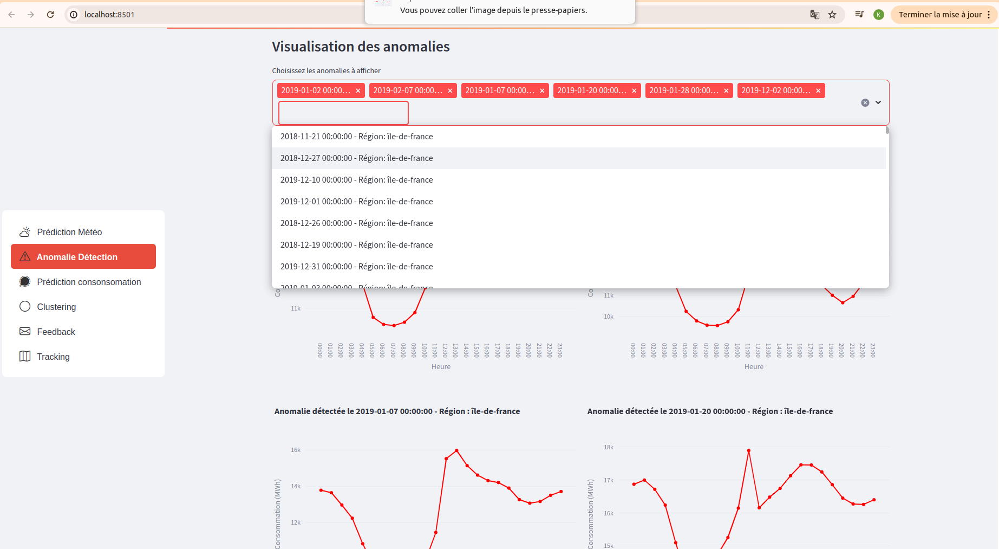
   
   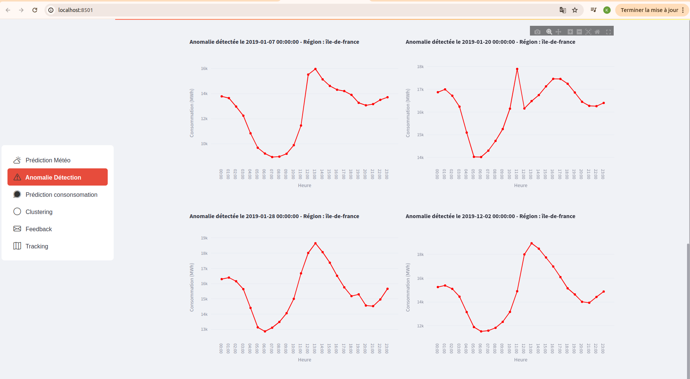
   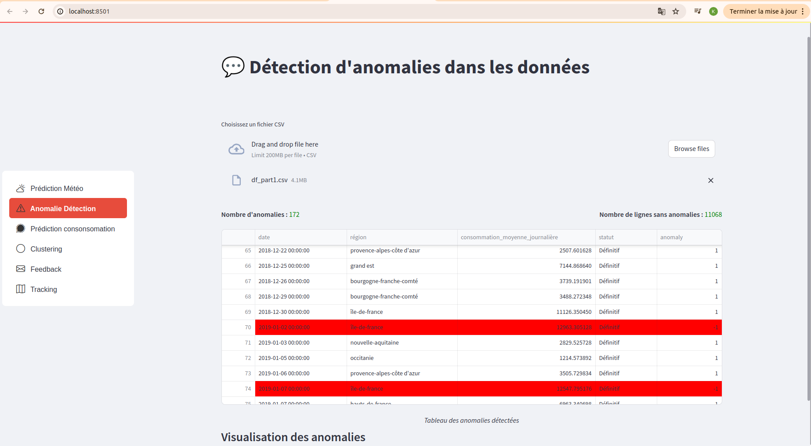

2. **Clustering**

   
   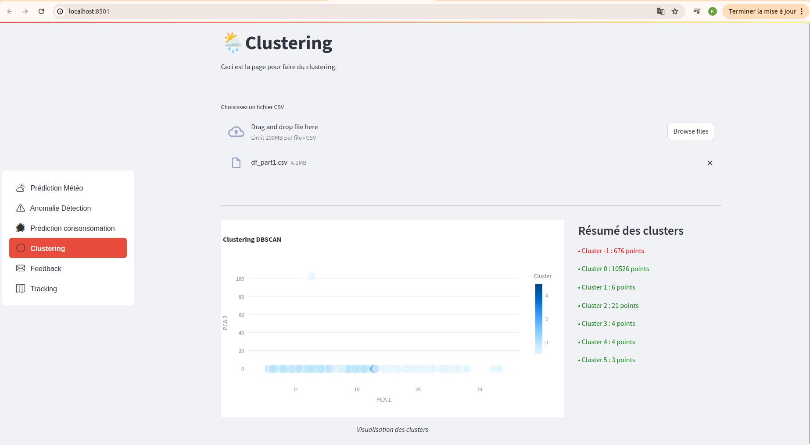
   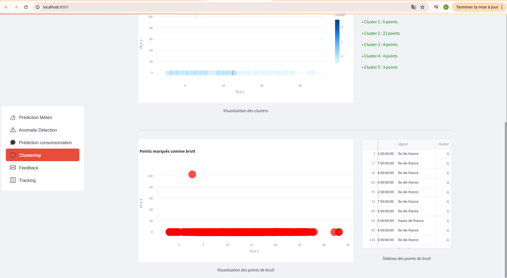
   

3. **Prédiction de la consommation prise en compte des mouvements sociaux**

   
   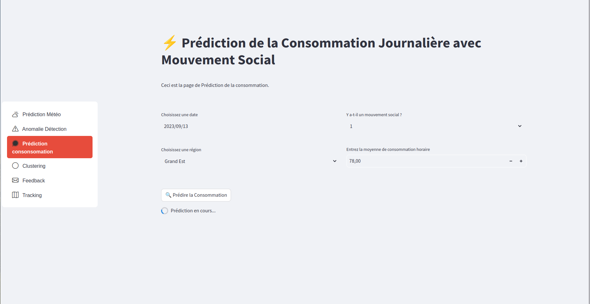
   

4. **Prédiction de la consommation prise en compte météo**

   

5. **Feedback utilisateur**

   
   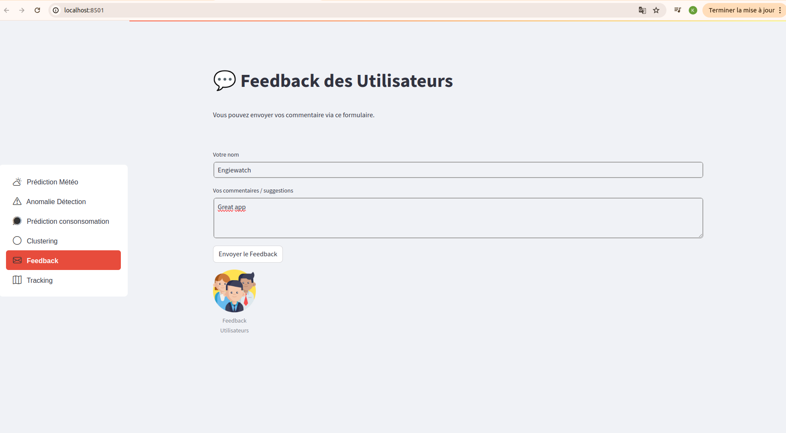
   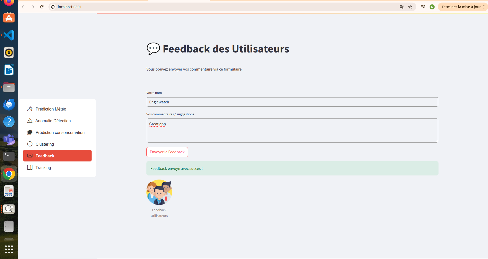
   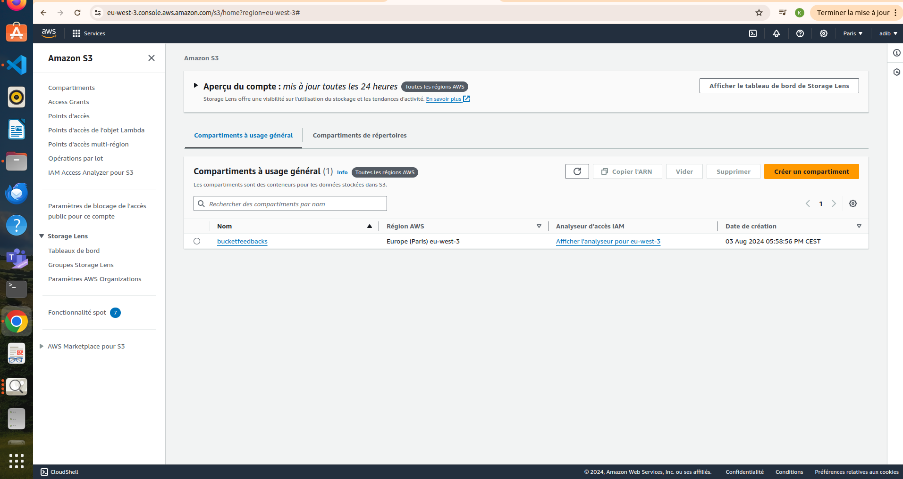
   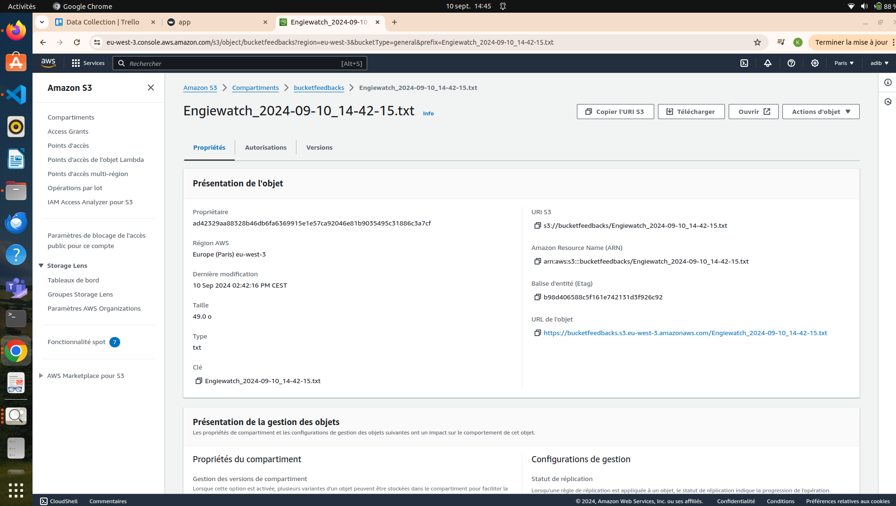
   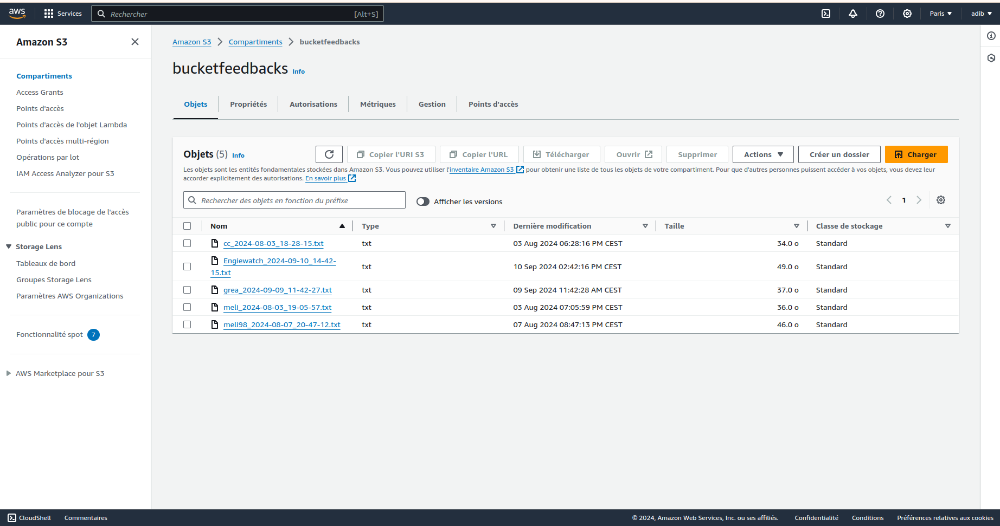

6. **Suivi des résultats**

   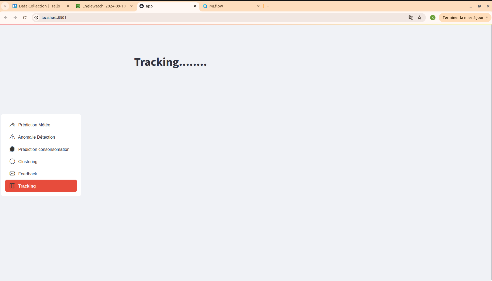
   
