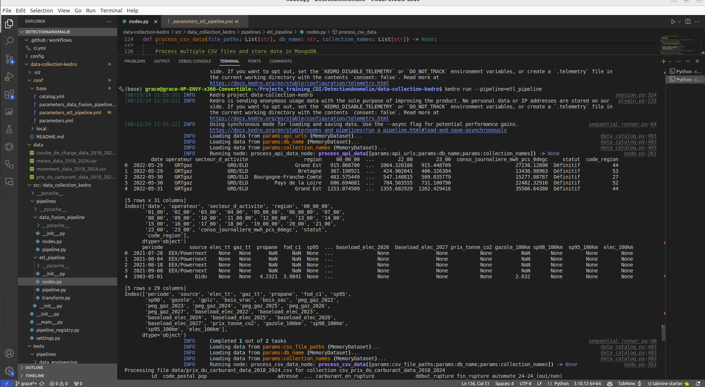
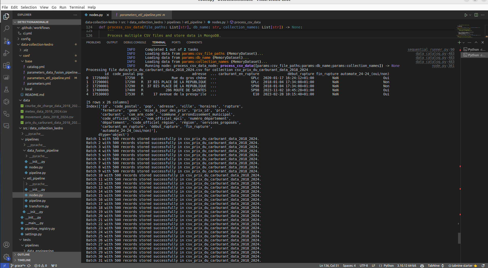
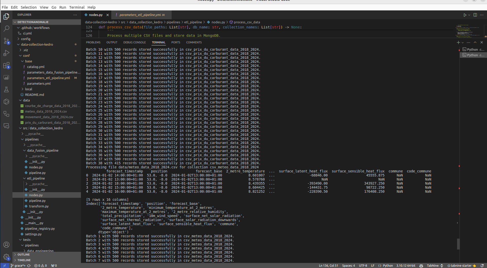
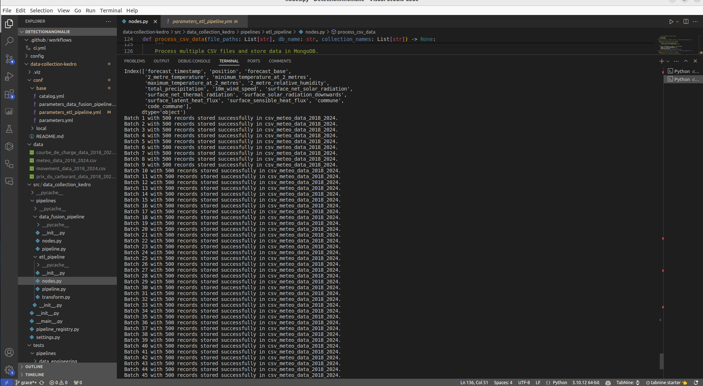
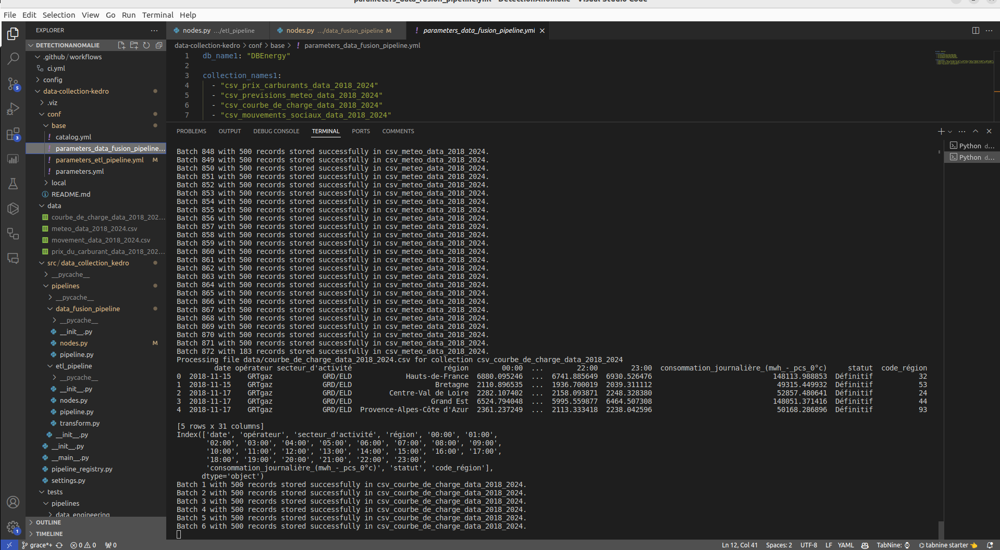

# **🚀 Data-collection-kedro - Projet Kedro**

## **Table des matières** 📚
1. [Vue d'ensemble du projet](#vue-densemble-du-projet)
2. [Architecture du projet](#architecture-du-projet)
3. [Installation et configuration](#installation-et-configuration)
4. [Structure du projet](#structure-du-projet)
5. [Exécution du projet](#exécution-du-projet)
6. [Description des pipelines](#description-des-pipelines)
7. [Fichiers de configuration](#fichiers-de-configuration)
8. [Tests du projet](#tests-du-projet)
9. [Exemples d'images](#exemples-dimages)


---

## **Vue d'ensemble du projet** 🌍 <a name="vue-densemble-du-projet"></a>

`Data-collection-kedro` est un projet de pipeline de données construit autour du framework Kedro, utilisé pour automatiser les processus d'extraction, de transformation et de chargement (ETL). Il est inclure dans notre projet de détection d'anomalies dans des données temporelles et catégoriques, avec stockage des données dans MongoDB et Elasticsearch.

Le projet se concentre sur l'intégration de données provenant de diverses sources (API, fichiers CSV, XML), leur stockage et leur fusion dans des bases de données.

---

## **Architecture du projet** 🏗️ <a name="architecture-du-projet"></a>

Le projet suit une architecture modulaire basée sur Kedro, où chaque tâche de traitement de données est encapsulée dans des pipelines distincts pour favoriser la flexibilité et la maintenance.

### **Vue d'ensemble des pipelines :**

- **Pipeline ETL (`etl_pipeline`)** : Extraction, transformation et stockage des données dans MongoDB.
- **Pipeline de Fusion de Données (`data_fusion_pipeline`)** : Fusion et stockage des données dans Elasticsearch.

---

## **Installation et configuration** ⚙️ <a name="installation-et-configuration"></a>

### **Prérequis :**

- **Python 3.8** ou version plus récente
- **MongoDB** (cloud ou instance locale)
- **Elasticsearch** (cloud ou instance locale)
- **Docker** (optionnel pour containeriser le projet)

### **Étapes d'installation :**

1. **Cloner le dépôt :**
   ```bash
   git clone https://github.com/keagnon/DetectionAnomalie.git
   cd DetectionAnomalie
   ```

2. **Créer un environnement virtuel :**
   ```bash
   python -m venv venv
   source venv/bin/activate  # Unix
   # Ou
   venv\Scripts\activate     # Windows
   ```

3. **Installer les dépendances :**
   ```bash
   pip install -r requirements.txt
   ```

4. **Configurer les variables d'environnement :**
   Créez un fichier `.env` et renseignez les informations de connexion MongoDB et Elasticsearch :
   ```env
   MONGODB_USERNAME=nom_utilisateur_mongo
   MONGODB_PASSWORD=mot_de_passe_mongo
   MONGODB_CLUSTER=adresse_du_cluster_mongo
   MONGODB_DBNAME=nom_base_de_donnée

   ELASTIC_USERNAME=nom_utilisateur_elastic
   ELASTIC_PASSWORD=mot_de_passe_elastic
   ELASTIC_DEPLOYMENT_ENDPOINT=adresse_du_cluster_elastic

   ```

---

## **Structure du projet** 🗂️ <a name="structure-du-projet"></a>

La structure du projet suit les conventions de Kedro :

```
data-collection-kedro/
│
├── conf/                                # Fichiers de configuration
│   ├── base/
│   │   ├── catalog.yml                  # Définition des jeux de données et leurs emplacements
│   │   ├── parameters_data_fusion_pipeline.yml
│   │   ├── parameters_etl_pipeline.yml
│   │   └── parameters.yml               # Paramètres globaux du projet
│   └── local/                           # Configuration spécifique à l'environnement local
│
├── data/                                # Données utilisées dans le projet
│   ├── data_carburant_xml/
│   ├── data_merge/
│   ├── meteo/
│   │   ├── combined_meteo_data.csv
│   │   ├── courbe_de_charge_data_2018_2024.csv
│   │   ├── meteo_data_2018_2024.csv
│   │   ├── movement_data_2018_2024.csv
│   │   └── prix_du_carburant_data_2018_2024.csv
│   └── README.md                       # Documentation sur les données
│
├── images/                             # Captures d'écran
│   ├── data_fusion/
│   ├── elastic_search/
│   ├── etl_pipeline/
│   └── tests_unitaires/
│
├── kedro-dataeng-env/                   # Environnement virtuel Kedro
│
├── src/
│   ├── data_collection_kedro/           # Répertoire principal des sources du projet
│   │   ├── pipelines/                   # Pipelines de traitement des données
│   │   │   ├── data_fusion_pipeline/
│   │   │   │   ├── nodes.py             # Fonctions spécifiques au pipeline de fusion de données
│   │   │   │   ├── pipeline.py          # Définition des pipelines
│   │   │   ├── etl_pipeline/
│   │   │   │   ├── nodes.py             # Fonctions spécifiques au pipeline ETL
│   │   │   │   ├── transform.py         # Transformation des données pour ETL
│   │   │   └── utils.py                 # Fonctions utilitaires
│   │   ├── settings.py                  # Paramètres du projet Kedro
│   └── pipeline_registry.py             # Enregistrement des pipelines Kedro
│
├── tests/                               # Tests unitaires pour le projet
│   ├── pipelines/
│   │   ├── data_fusion_pipeline/
│   │   │   ├── test_pipeline.py         # Tests pour le pipeline de fusion de données
│   │   ├── etl_pipeline/
│   │   │   ├── test_pipeline.py         # Tests pour le pipeline ETL
│   │   │   ├── test_transform.py        # Tests pour les transformations de données ETL
│
├── Dockerfile                           # Fichier Docker pour containeriser le projet
├── pyproject.toml                       # Fichier de configuration du projet et des dépendances
├── README.md                            # Documentation principale du projet
└── requirements.txt                     # Liste des dépendances Python du projet

```

---

## **Exécution du projet** 🚀 <a name="exécution-du-projet"></a>

### **Exécuter localement :**

- **Exécuter tous les pipelines :**
   ```bash
   kedro run
   ```

- **Exécuter un pipeline spécifique :**
   ```bash
   kedro run --pipeline=etl_pipeline
   ```
   ou

   ```bash
   kedro run --pipeline=data_fusion_pipeline
   ```

### **Exécuter avec Docker :**

- **Construire l'image Docker :**
   ```bash
   docker build -t kedro-data-engineering .
   ```

- **Exécuter le conteneur Docker :**
   ```bash
   docker run -it kedro-data-engineering
   ```

---

## **Description des pipelines** 🔄 <a name="description-des-pipelines"></a>

### **Pipeline ETL (`etl_pipeline`)** 🛠️

- **Objectif** : Extraire des données API/CSV/XML, les transformer et les stocker dans MongoDB.
- **Fonctions principales** :
  - `fetch_data_from_api()`
  - `read_csv_file()`
  - `store_in_mongodb()`

### **Pipeline de Fusion de Données (`data_fusion_pipeline`)** 🔗

- **Objectif** : Fusionner plusieurs jeux de données, normaliser les colonnes et les stocker dans Elasticsearch.
- **Fonctions principales** :
  - `load_collections()`
  - `select_columns()`
  - `normalize_columns()`
  - `merge_data_store_in_elastic()`

---

## **Fichiers de configuration** 🛠️ <a name="fichiers-de-configuration"></a>

### **1. `parameters_data_fusion_pipeline.yml`** :
- Définit les jeux de données, leurs sources et destinations (MongoDB, Elasticsearch).

### **2. `parameters_etl_pipeline.yml`** :
- Contient les paramètres globaux comme la taille des chunks ou les URL des API.

---

## **Tests du projet** 🧪 <a name="tests-du-projet"></a>

Les tests sont réalisés avec **pytest**. Les tests unitaires sont disponibles dans le répertoire `tests/`.

### **Exécuter les tests :**

- **Tous les tests** :
   ```bash
   pytest tests/
   ```

- **Tester un pipeline spécifique** :
   ```bash
   pytest tests/pipelines/etl_pipeline/
   ```

---

## **Exemples d'images** 🖼️ <a name="exemples-dimages"></a>

Ici vous trouverez les captures d'écran des exécutions de nos pipelines, ainsi que des résultats de tests ou du coverage :


### **Exemple d'image - Tests unitaires et couverture :**

```markdown


```

### **Exemple d'image - Visualisation MongoDB :**

Vous pouvez également ajouter une capture de la base de données MongoDB :

```markdown


```

### **Exemple d'image - Exécution du pipeline ETL :**








### **Exemple d'image - Visualisation Elasticsearch :**

De la même manière, ajoutez une capture pour Elasticsearch :

```markdown


```

### **Exemple d'image - Exécution du pipeline de fusion :**

```markdown


```


