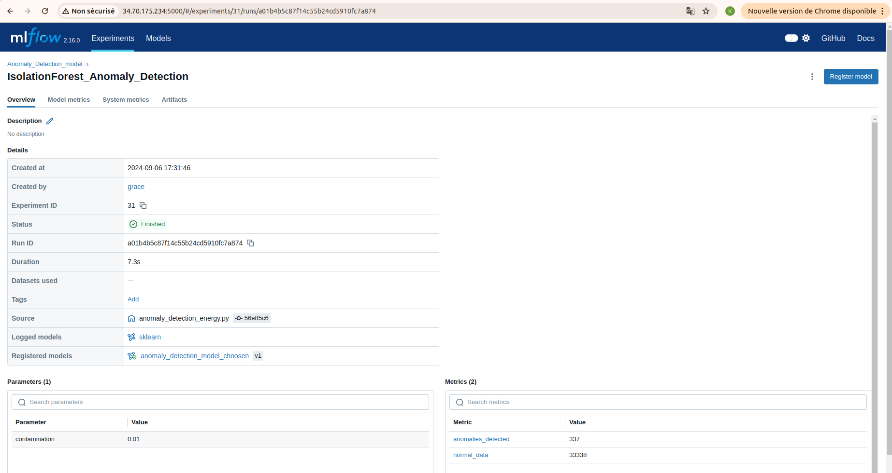
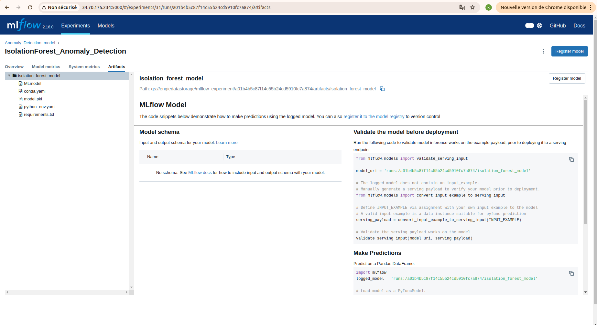
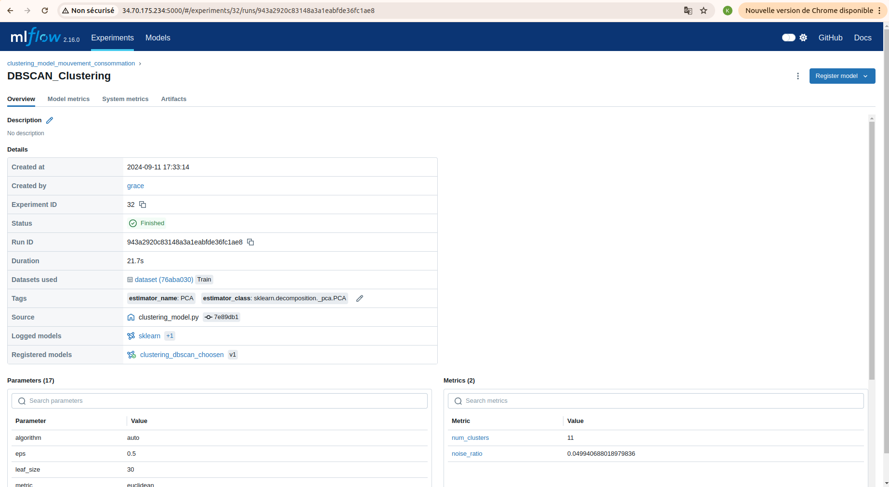
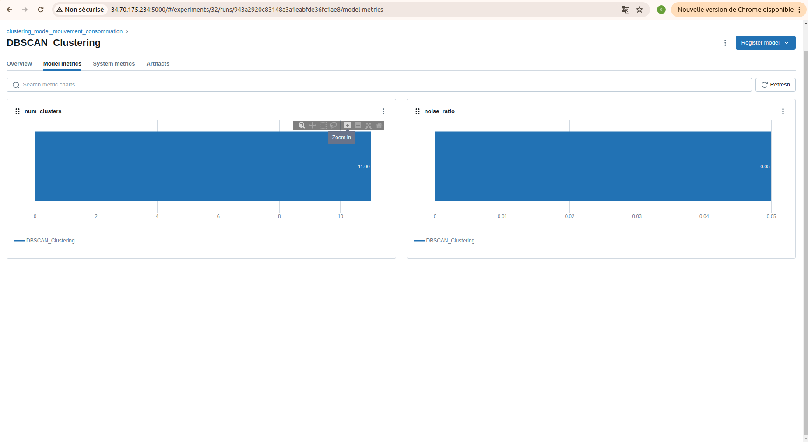
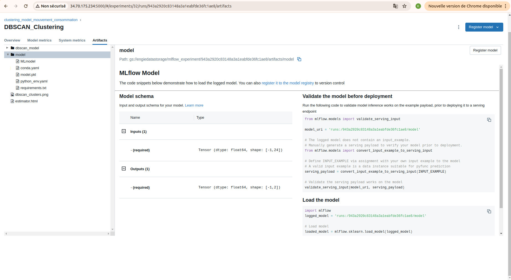
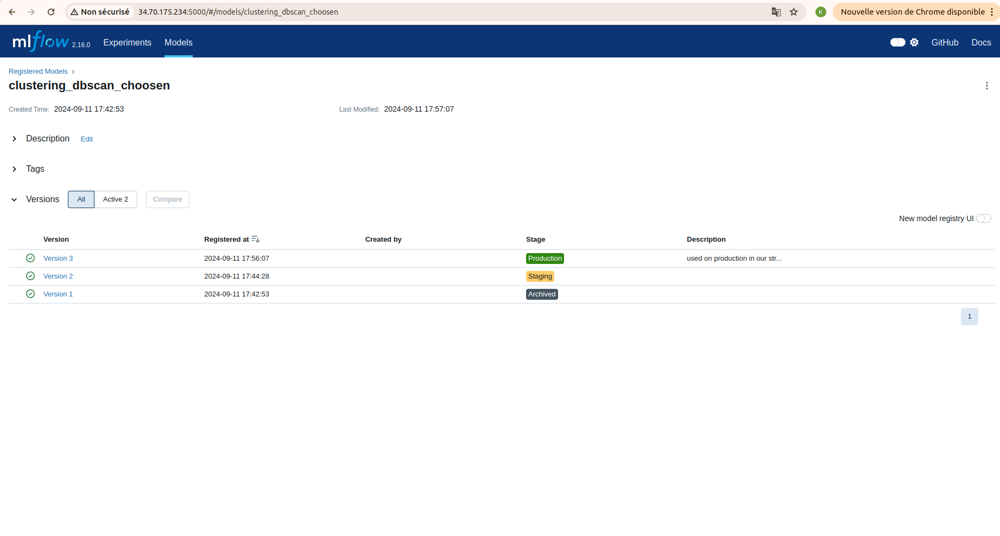

# 📊 Modèles de ML pour la Prédiction et la Détection d'Anomalies Énergétiques

### 🔗 Langage


### 🛠️ Frameworks et Outils de Développement


### 📊 Machine Learning & Data Science


### ☁️ Cloud & Stockage


## 📑 Présentation du Projet


Ce projet fait partie de notre solution globale de **détection d'anomalies** dans la consommation énergétique, combinant plusieurs techniques avancées de machine learning. L'application utilise l'algorithme **Isolation Forest** pour identifier les comportements anormaux dans les données. Elle intègre également des méthodes de **clustering**, notamment **K-means** et **DBSCAN**, afin de regrouper les régions en fonction de la similitude de leur consommation énergétique.

Pour la **prédiction de la consommation future**, des modèles de régression tels que **Ridge Regression** et **Random Forest** sont déployés, prenant en compte divers facteurs externes comme les **mouvements sociaux**.

Le suivi et la gestion des modèles sont assurés via **MLflow**, qui permet une traçabilité complète des versions et des performances des modèles. Nous avons choisi de déployer MLflow sur une infrastructure cloud via **Google Cloud Platform (GCP)**, offrant ainsi un accès centralisé et une flexibilité dans la gestion des artefacts. L'URL du serveur MLflow est stockée dans nos fichiers `.env`, facilitant l'accès et l'utilisation de l'outil.


## 📚 Sommaire

1. [📦 Installation](#installation)
2. [🚀 Utilisation de l'Application](#utilisation)
3. [📁 Structure du Projet](#structure-du-projet)
4. [🖼️ Interface Utilisateur](#interface-utilisateur)
5. [📈 Intégration avec MLflow](#intégration-mlflow)
6. [🖼️ Captures d'écran](#captures-d’écran)


## 📦 Installation <a name="installation"></a>

Avant de commencer, assurez-vous d'avoir **Python 3.10+** et les bibliothèques nécessaires installés.

### Étapes d'installation

1. **Clonez ce dépôt :**

   ```bash
   git clone https://github.com/keagnon/DetectionAnomalie.git
   cd DetectionAnomalie
   ```

2. **Installez les dépendances :**

   ```bash
   pip install -r requirements.txt
   ```

3. **Configuration des variables d'environnement :**

   Créez un fichier `.env` avec les informations suivantes :

   ```env
   GOOGLE_APPLICATION_CREDENTIALS=chemin/vers/credentials.json
   MLFLOW_TRACKING_URI=url-du-suivi-mlflow
   MLFLOW_ARTEFACTS_LOCATION=gs://votre-bucket/mlflow
   ```

## 🚀 Utilisation de l'Application <a name="utilisation"></a>

Pour lancer l'application **Streamlit**, exécutez la commande suivante dans le répertoire racine :

```bash
streamlit run StreamlitUI/app_detection_anomalie.py
```

Vous pouvez également exécuter les autres modules de l'interface Streamlit pour explorer les fonctionnalités spécifiques comme le clustering et la prédiction :

```bash
streamlit run StreamlitUI/app_clustering.py
```

```bash
streamlit run StreamlitUI/app_prediction_conso_mvt.py
```

L'application permet de :

- **Charger des jeux de données** pour analyser la consommation.
- **Lancer la détection d'anomalies** sur des périodes ou des régions spécifiques.
- **Visualiser les clusters et les prédictions** de manière interactive.


## 📁 Structure du Projet <a name="structure-du-projet"></a>

Le projet est organisé de manière modulaire pour garantir une maintenabilité et une évolutivité optimales. Voici la structure principale :

```bash
mouvement_consommation/
    mlruns/                       # Expériences MLflow
    tests_models/                 
        data_test/                # Jeux de données de test
        fusion_courbe_mouvement.csv
        merge_courbe_movement.csv
    StreamlitUI/                  # Fichiers pour l'interface Streamlit
        app_clustering.py         # Interface pour le clustering
        app_detection_anomalie.py # Interface pour la détection d'anomalies
        app_prediction_conso_mvt.py # Interface pour la prédiction
    clustering_model.py           # Implémentation des modèles de clustering
    prediction_conso_mvt.py       # Modèle de prédiction de la consommation
    anomaly_detection_energy.py   # Détection des anomalies dans la consommation
.env                              # Variables d'environnement (non incluses dans le dépôt)
requirements.txt                  # Liste des dépendances
Readme.md                         # Fichier README
```


## 🖼️ Interface Utilisateur <a name="interface-utilisateur"></a>

L'interface **Streamlit** permet une interaction directe avec les modèles de machine learning. Voici les principales fonctionnalités :

1. **Détection d'Anomalies** : Détection des anomalies dans les données de consommation énergétique avec **Isolation Forest**.
   - L'utilisateur peut charger des jeux de données, lancer l'algorithme et visualiser les anomalies détectées.
   - Les résultats sont stockés et suivis sur **MLflow**.

2. **Clustering** : L'algorithme de clustering (K-means ou DBSCAN) regroupe les régions par similitudes.
   - Une visualisation des clusters est disponible après l'exécution, avec possibilité de les sauvegarder dans **MLflow**.

3. **Prédiction de la Consommation** : La prédiction de la consommation énergétique est effectuée à l'aide de modèles comme **Ridge Regression** et **Random Forest**.
   - L'utilisateur peut ajuster les hyperparamètres et observer les performances du modèle.


## 📈 Intégration avec MLflow <a name="intégration-mlflow"></a>

**MLflow** est utilisé pour le suivi, la gestion et la comparaison des modèles de machine learning développés dans ce projet. Il enregistre des métriques comme l'**inertie** pour **K-means**, la taille des clusters ou encore le **taux de contamination** pour **Isolation Forest**, permettant ainsi une traçabilité complète des expériences et une optimisation des hyperparamètres.

### Déployer MLflow

#### 1. Utilisation Locale de MLflow

Pour un déploiement local de MLflow, voici les étapes à suivre :

1. **Installer MLflow** :
   ```bash
   pip install mlflow
   ```

2. **Démarrer le serveur MLflow** :
   ```bash
   mlflow ui
   ```

3. **Accéder à l'interface** :
   Rendez-vous sur `http://localhost:5000` pour suivre vos expériences et gérer vos modèles localement.

#### 2. Utilisation de MLflow sur le Cloud (GCP)

Nous avons opté pour une solution cloud avec **Google Cloud Platform (GCP)** pour la gestion centralisée des modèles et des artefacts. L'URL du serveur MLflow est stockée dans les fichiers `.env` pour un accès facile.

Pour configurer MLflow sur GCP :

1. **Créer un bucket Google Cloud** pour stocker les artefacts.
2. **Déployer MLflow sur une instance Compute Engine**.
3. **Configurer les variables d'environnement** pour connecter MLflow au bucket et au serveur.

Pour plus de détails sur la mise en place de MLflow sur GCP, consultez le fichier **PDF** dans le répertoire **documentation** :

📄 [Documentation - Mise en place du serveur MLflow sur GCP](https://github.com/keagnon/DetectionAnomalie/blob/grace_clustering_mvt/documentation/etapes_mise_en_place.pdf)

## 🖼️ Captures d'écran <a name="captures-d’écran"></a>

1. **Détection d'Anomalies**

   
   
   
   
   
   
   
   

2. **Clustering**

   
   
   
   
   
   
   
   
   


3. **Prédiction de la consommation prise en compte des mouvements sociaux**

   
   
   
   
   
   
   


