# 📊 Modèles de ML pour la Prédiction et la Détection d'Anomalies Énergétiques

### 🔗 Langage


### 🛠️ Frameworks et Outils de Développement


### Empreinte Carbone


### 📊 Machine Learning & Data Science


### ☁️ Cloud & Stockage


## 📑 Présentation du Projet


Ce projet fait partie de notre solution globale de **détection d'anomalies** dans la consommation énergétique, combinant plusieurs techniques avancées de machine learning. L'application utilise l'algorithme **Isolation Forest** pour identifier les comportements anormaux dans les données. Elle intègre également des méthodes de **clustering**, notamment **K-means** et **DBSCAN**, afin de regrouper les régions en fonction de la similitude de leur consommation énergétique.

Pour la **prédiction de la consommation future**, des modèles de régression tels que **Ridge Regression** et **Random Forest** sont déployés, prenant en compte divers facteurs externes comme les **mouvements sociaux**.

Le suivi et la gestion des modèles sont assurés via **MLflow**, qui permet une traçabilité complète des versions et des performances des modèles. Nous avons choisi de déployer MLflow sur une infrastructure cloud via **Google Cloud Platform (GCP)**, offrant ainsi un accès centralisé et une flexibilité dans la gestion des artefacts. L'URL du serveur MLflow est stockée dans nos fichiers `.env`, facilitant l'accès et l'utilisation de l'outil.


## 📚 Sommaire

1. [📦 Installation](#installation)
2. [🚀 Utilisation de l'Application](#utilisation)
3. [📁 Structure du Projet](#structure-du-projet)
4. [🌍 Calcul empreinte carbone](#empreinte_carbone)
5. [🖼️ Interface Utilisateur](#interface-utilisateur)
6. [📈 Intégration avec MLflow](#intégration-mlflow)
7. [🖼️ Captures d'écran](#captures-d’écran)

## 📦 Installation <a name="installation"></a>

Avant de commencer, assurez-vous d'avoir **Python 3.10+** et les bibliothèques nécessaires installés.

### Étapes d'installation

1. **Clonez ce dépôt :**

   ```bash
   git clone https://github.com/keagnon/DetectionAnomalie.git
   cd DetectionAnomalie
   ```

2. **Installez les dépendances :**

   ```bash
   pip install -r requirements.txt
   ```

3. **Configuration des variables d'environnement :**

   Créez un fichier `.env` avec les informations suivantes :

   ```env
   GOOGLE_APPLICATION_CREDENTIALS=chemin/vers/credentials.json
   MLFLOW_TRACKING_URI=url-du-suivi-mlflow
   MLFLOW_ARTEFACTS_LOCATION=gs://votre-bucket/mlflow
   ```

## 🚀 Utilisation de l'Application <a name="utilisation"></a>

Pour lancer l'application **Streamlit**, exécutez la commande suivante dans le répertoire racine :

```bash
streamlit run StreamlitUI/app_detection_anomalie.py
```

Vous pouvez également exécuter les autres modules de l'interface Streamlit pour explorer les fonctionnalités spécifiques comme le clustering et la prédiction :

```bash
streamlit run StreamlitUI/app_clustering.py
```

```bash
streamlit run StreamlitUI/app_prediction_conso_mvt.py
```

L'application permet de :

- **Charger des jeux de données** pour analyser la consommation.
- **Lancer la détection d'anomalies** sur des périodes ou des régions spécifiques.
- **Visualiser les clusters et les prédictions** de manière interactive.


## 📁 Structure du Projet <a name="structure-du-projet"></a>

Le projet est organisé de manière modulaire pour garantir une maintenabilité et une évolutivité optimales. Voici la structure principale :

```bash
mouvements_consommation/
├── images/                               # Répertoire contenant des sous-répertoires d'images
│   ├── anomaly_detection/                # Images pour la détection d'anomalies
│   ├── clustering/                       # Images pour le clustering
│   └── prediction_mouvement/             # Images pour la prédiction de mouvements
│   └── other/                            # Autres images
│   └── logs_carbon/                      # Répertoire contenant des sous-répertoires d'images pour les logs de suivi de l'empreinte carbone
│        ├── dbscan/                      # Images logs de carbone pour le modèle DBSCAN
│        ├── isolationforest/             # Images logs de carbone pour le modèle Isolation Forest
│        ├── random_forest/               # Images logs de carbone pour le modèle Random Forest
│        ├── ridge/                       # Images logs de carbone pour le modèle Ridge Regression
│
├── log/                                  # Répertoire pour les logs divers
│   ├── dbscan/                           # Logs pour DBSCAN
│   ├── log_carbon_anomalie/              # Log carbone pour la détection d'anomalies
│   ├── log_carbon_random_forest_model/   # Log carbone pour Random Forest
│   └── log_carbon_ridge_model/           # Log carbone pour Ridge Regression
│
├── mlruns/                               # Répertoire pour les expériences MLflow
├── modele_mouvement_conso/               # Modèles de mouvement de consommation
├── tests_models/                         # Répertoire pour les tests des modèles
│   └── data_test/                        # Jeux de données de test
│
├── anomaly_detection_energy.py           # Détection des anomalies dans la consommation énergétique
├── clustering_model.py                   # Implémentation des modèles de clustering
├── prediction_conso_mvt.py               # Modèle de prédiction de la consommation prenant en compte les mouvements
├── mlflow_utils.py                       # Utilitaires pour MLflow
├── register_model.py                     # Script pour l'enregistrement des modèles
├── .env                                  # Variables d'environnement (non incluses dans le dépôt)
├── requirements.txt                      # Liste des dépendances
└── Readme.md                             # Fichier README

```

## 🌍 Calcul empreinte carbone <a name="empreinte_carbone"></a>

Dans le cadre de ce sous-projet dédié à la **détection d'anomalies** dans la consommation énergétique, nous avons intégré le suivi de l'empreinte carbone à travers **CodeCarbon**. Ce suivi a permis de mesurer l'impact environnemental des différents algorithmes utilisés, tels que **Isolation Forest** pour la détection d'anomalies, et les méthodes de **clustering** comme **K-means** et **DBSCAN**. De plus, des modèles de régression tels que **Ridge Regression** et **Random Forest**, qui prennent en compte des facteurs comme les **mouvements sociaux**, ont été évalués en termes d'émissions de CO2eq lors de leur exécution.

Les résultats de ces suivis sont stockés dans des logs pour analyser et optimiser l'efficacité énergétique de chaque composant. [voir section capture d'écran](#captures-d’écran)


## 🖼️ Interface Utilisateur <a name="interface-utilisateur"></a>

L'interface **Streamlit** permet une interaction directe avec les modèles de machine learning. Voici les principales fonctionnalités :

1. **Détection d'Anomalies** : Détection des anomalies dans les données de consommation énergétique avec **Isolation Forest**.
   - L'utilisateur peut charger des jeux de données, lancer l'algorithme et visualiser les anomalies détectées.
   - Les résultats sont stockés et suivis sur **MLflow**.

2. **Clustering** : L'algorithme de clustering (K-means ou DBSCAN) regroupe les régions par similitudes.
   - Une visualisation des clusters est disponible après l'exécution, avec possibilité de les sauvegarder dans **MLflow**.

3. **Prédiction de la Consommation** : La prédiction de la consommation énergétique est effectuée à l'aide de modèles comme **Ridge Regression** et **Random Forest**.
   - L'utilisateur peut ajuster les hyperparamètres et observer les performances du modèle.


## 📈 Intégration avec MLflow <a name="intégration-mlflow"></a>

**MLflow** est utilisé pour le suivi, la gestion et la comparaison des modèles de machine learning développés dans ce projet. Il enregistre des métriques comme l'**inertie** pour **K-means**, la taille des clusters ou encore le **taux de contamination** pour **Isolation Forest**, permettant ainsi une traçabilité complète des expériences et une optimisation des hyperparamètres.

### Déployer MLflow

#### 1. Utilisation Locale de MLflow

Pour un déploiement local de MLflow, voici les étapes à suivre :

1. **Installer MLflow** :
   ```bash
   pip install mlflow
   ```

2. **Démarrer le serveur MLflow** :
   ```bash
   mlflow ui
   ```

3. **Accéder à l'interface** :
   Rendez-vous sur `http://localhost:5000` pour suivre vos expériences et gérer vos modèles localement.

#### 2. Utilisation de MLflow sur le Cloud (GCP)

Nous avons opté pour une solution cloud avec **Google Cloud Platform (GCP)** pour la gestion centralisée des modèles et des artefacts. L'URL du serveur MLflow est stockée dans les fichiers `.env` pour un accès facile.

Pour configurer MLflow sur GCP :

1. **Créer un bucket Google Cloud** pour stocker les artefacts.
2. **Déployer MLflow sur une instance Compute Engine**.
3. **Configurer les variables d'environnement** pour connecter MLflow au bucket et au serveur.

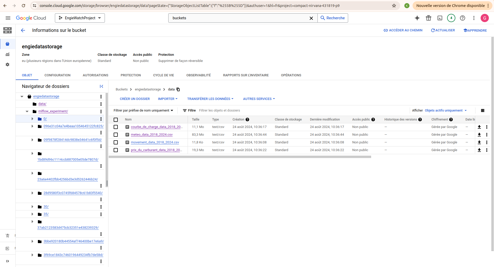
Pour plus de détails sur la mise en place de MLflow sur GCP, consultez le fichier **PDF** dans le répertoire **documentation** :

📄 [Documentation - Mise en place du serveur MLflow sur GCP](https://github.com/keagnon/DetectionAnomalie/blob/grace_clustering_mvt/documentation/etapes_mise_en_place.pdf)

## 🖼️ Captures d'écran <a name="captures-d’écran"></a>

1. **Détection d'Anomalies**

   
   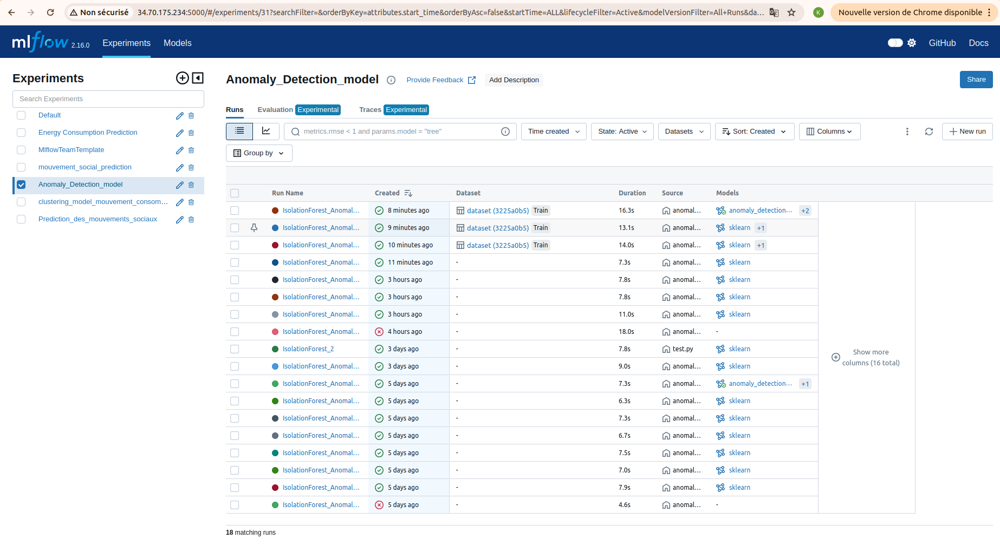
   
   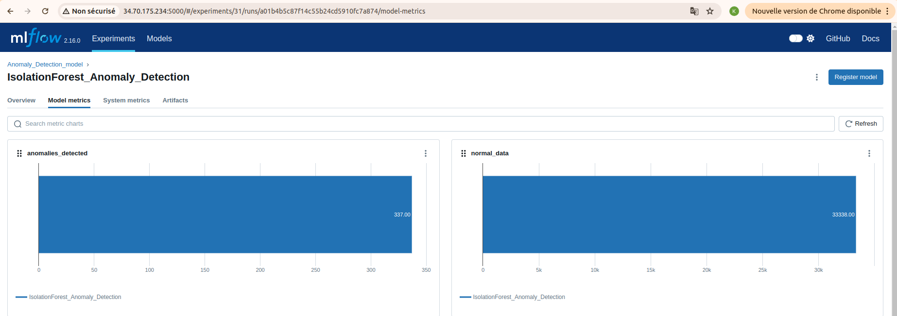
   
   
   
   

2. **Clustering**

   
   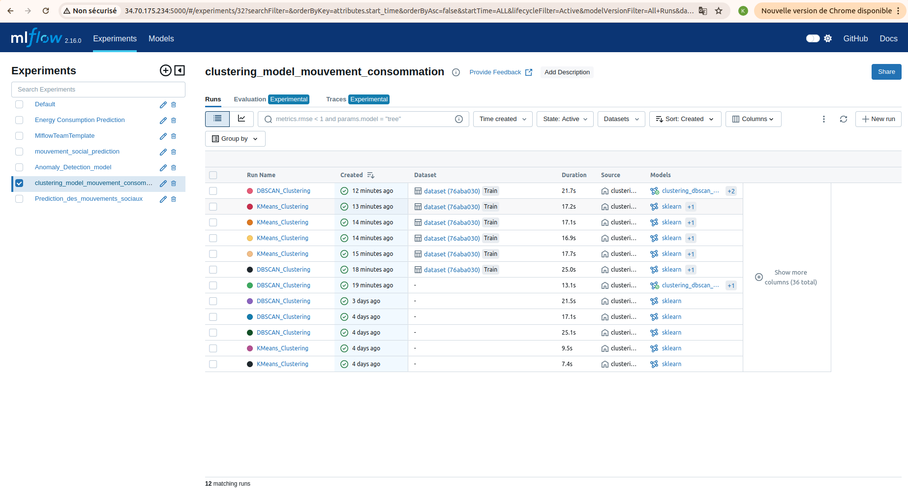
   
   
   
   
   
   
   


3. **Prédiction de la consommation prise en compte des mouvements sociaux**

   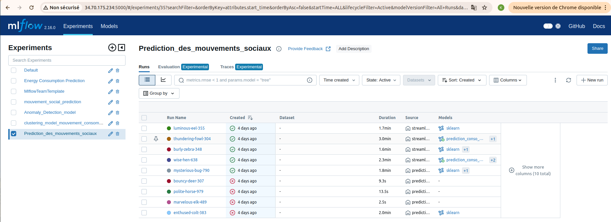
   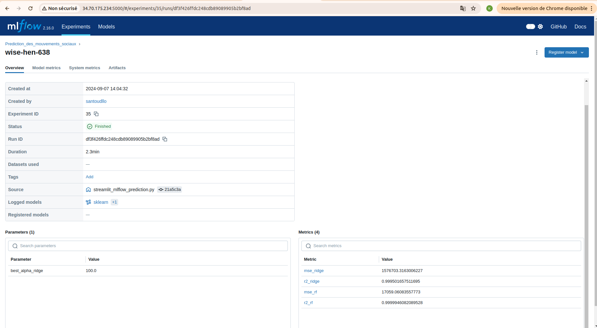
   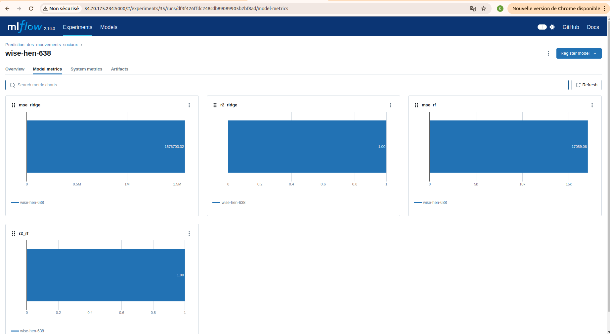
   
   
   
   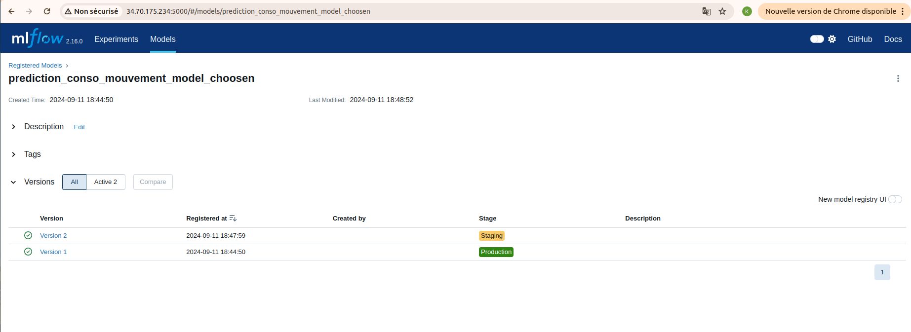

3. **Empreinte carbone modèle DBSCAN**

   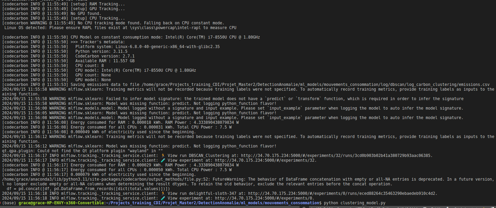
   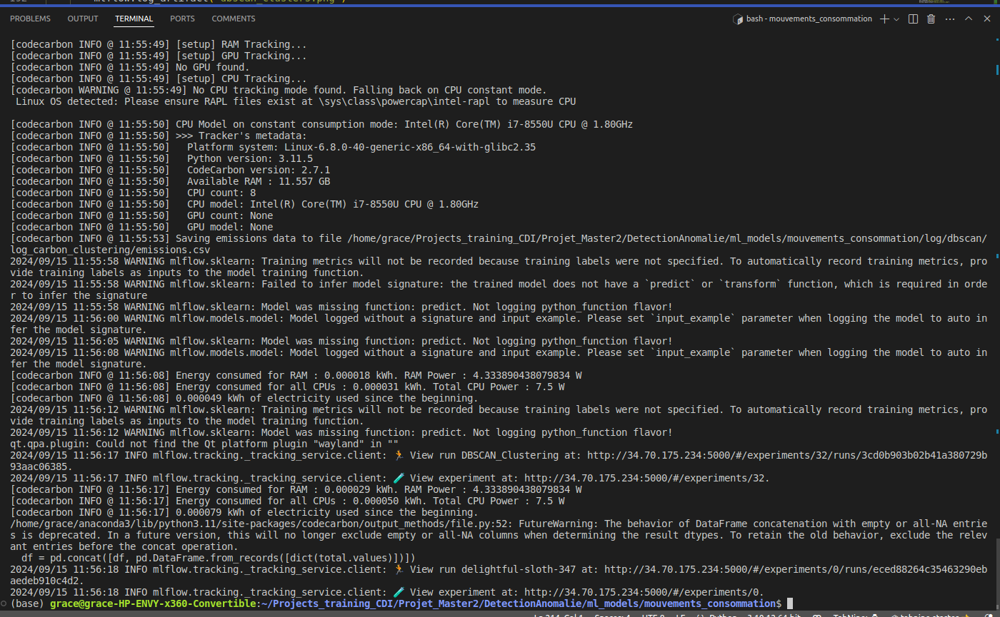

3. **Empreinte carbone modèle Ridge**

   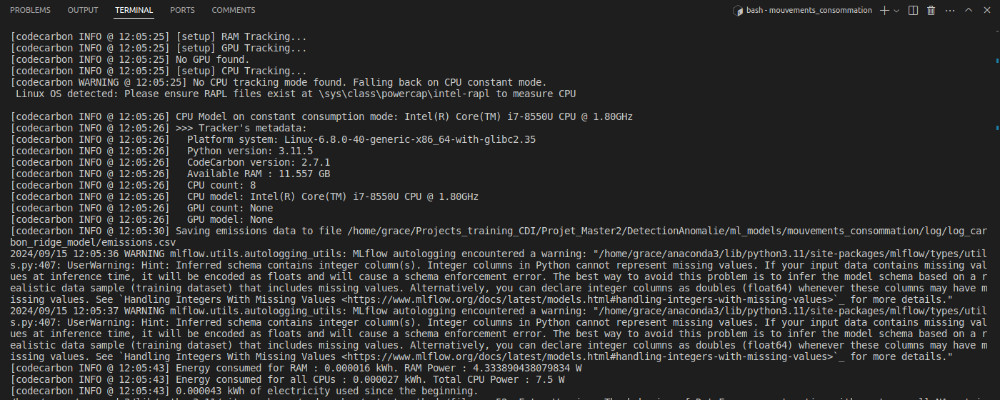

3. **Empreinte carbone modèle Random Forest**

   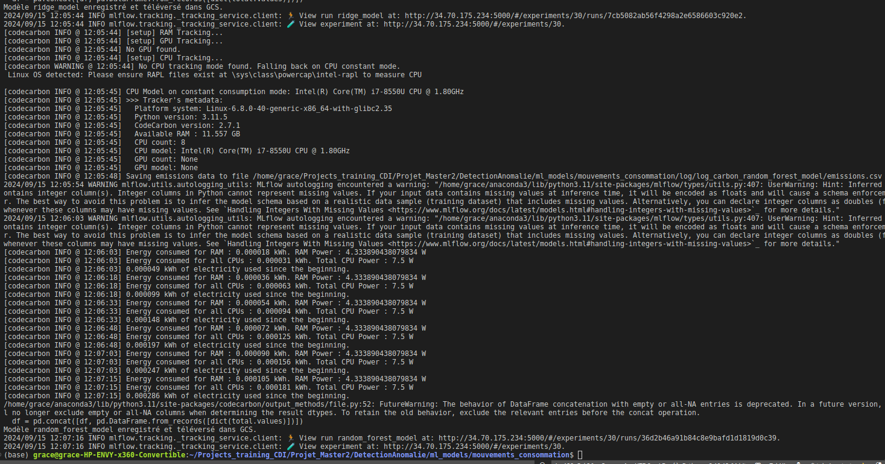
   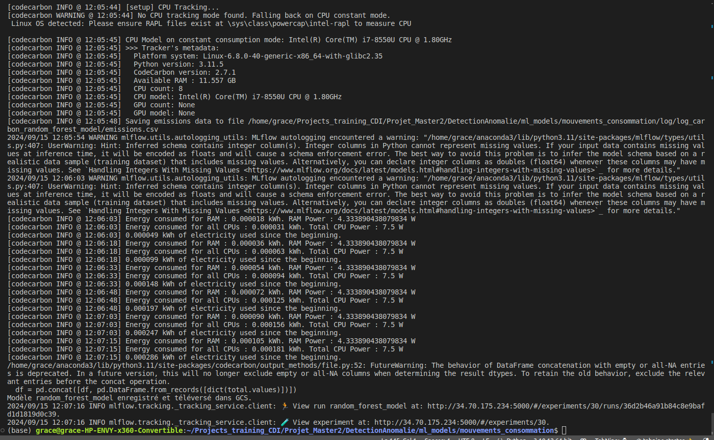

3. **Empreinte carbone modèle IsolationForest**

   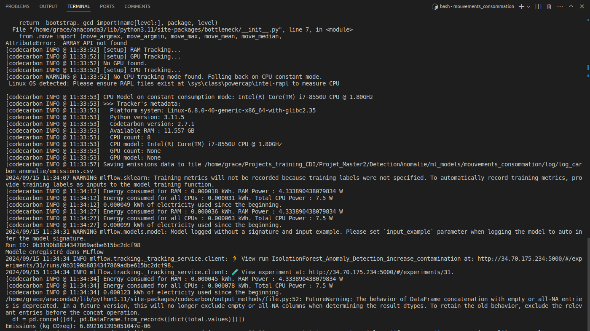
   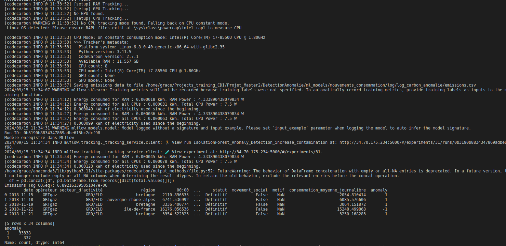

